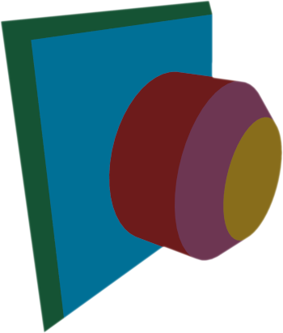
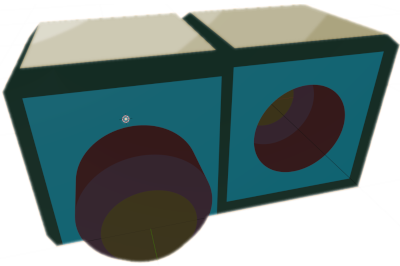
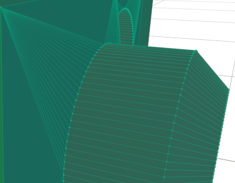
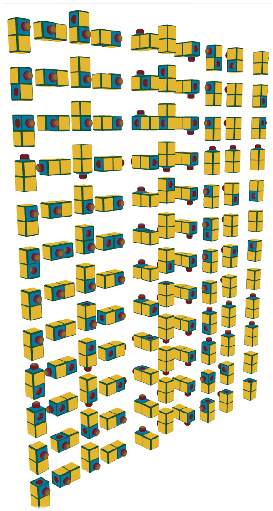

# Interlock: new challenges

## Description
C program to generate new challenges for:
"Interlock, the hide the plug and socket puzzle!"

[Smartgames](https://www.smartgames.eu/) do the best brain-teaser games around. 
I have almost all (if not all!) their games.
They are all great (if not excellent), but Interlock, which
is *not* from Smartgames, is, IMHO, one of the best brain-teaser ever.
Would it be better designed, with more challenges, it would be the best.
But as it is now, it's already one of the best!

My advice: if you're into brain-teasers, buy it, it's worth very penny!


## Why do a program to generate all challenges for this brain-teaser?
There are 50 possible combinations / challenges.
The two hardest ones are these, which use 11 blocks:


So, the two hardest ones use 11 blocks... and we have 12 blocks!

**There is no combinations / challenges that uses the 12 blocks of the game!**

I find this very frustrating.

How about programming a solver, and after I've done this, create new challenges,
and maybe if it's possible, create new blocks to see if we can have different
blocks and brand-new challenges?

## How to do it? Which language, and why?

- I wanted a **very fast** language,
- I wanted **not** to rely on a library that makes bad hidden things
- I wanted to be able to say: "if it doesn't work properly, it's 100% my fault,
  and I can optimize my code: it's not an obscure strange library made by 
  someone else that I'm using".

I don't know if I will ever succeed, that's the whole point of all of this, 
actually!

Here are my thoughts: today, almost all languages rely on tons of libraries
written by someone else.
This implies that you rely on other's code, and you write very few lines of 
code.
I'm a Php *and* Python senior developer, I do this every day... 
It's *always* working, but like "magically" working: it's not you who actually
did the work, it's someone else who did 99% of the work... and when it's not
working you're in deep trouble: you need to understand where is the problem,
who did it and how to correct the library's code... and it takes ages to solve
it - when you can solve it... because most of the time you can't,
you have to find a workaround...


## Diary

### 2022-03-12
I worked this whole saturday afternoon to have a basic C working skeleton:
- a list of "blocks"
- a "block is made of "parts"
- a "part" is a 3D cube + information saying if it's the base of the "block"
or a 3D cube with an *offset* from the base of the "block"

This might sound complex for a game with blocks that have only 2 cubes,
but organizing things like this, I will be able to have more than 2 cubes for 
one block.

### 2022-03-13
I updated this [`readme.md`](./readme.md) to explain why I'm doing this (*and 
motivate myself!*). If you are interested, I will gladly answer (to guess 
my mail, it's simple: take 
[my name from here](https://github.com/olivierpons/) and add "at gmail.com").

Entered the 12 blocks configuration in my `main.c` file.

Made my code run under Linux, so I can use valgrind.

Made sure there's no memory leak:

```
HEAP SUMMARY:
    in use at exit: 0 bytes in 0 blocks
  ...blabla...
All heap blocks were freed -- no leaks are possible
```
Yay!

### 2022-03-18
First "good" valid 3D obj file.
I still have problems with the color vector: I should 
create/re-use if existing one for each block I generate,
but I just want to focus on generating a whole Interlock
block.


Thanks to https://3dviewer.net/, I can validate my obj file:


### 2022-03-20
Worked a *lot* on 3D generation. To make a long story short: now I
generate dynamically a face of an object with a plug, and I rotate it
if I need it for another face.
Here's what I can generate: 4 faces, each one with a specific rotation:


So I can consider the first point done.
Now I have to join the points of a circle with the points of a square
(to be able to have a "hole" = a "socket" in the face).
So I've done 50% of the point `2` (see below).

### 2022-03-26
01h35: I've finally done it! I've managed to connect a sphere to a square!
This wasn't easy, believe me!
Now I can have blocks with plugs & sockets!
Step 2 (below) almost done!



19h24: Step 2 (below) 100% done:

Not only can I generate a full block...



...but the full block is also working - in the 3D sense: I can open it under
Blender:



### 2022-03-29
I forgot one step (that I've done tonight): pre-compute all possible rotations,
using the "roll / pitch / yaw" principle.

### 2022-03-30
I reached those goals:
- pre-compute all possible rotations,
  using the "roll / pitch / yaw" principle
- giving a whole world of "blocks" (only Cube's actually), generate a full 
  3D `obj` file.

So, I've generated all the blocks possible in all possible rotations, and here
they are:

  

 
### Next steps
1. **`✓ 100%`**: see `2022-03-18` above:
   Make basic library to write a Wavefront `obj` file,
   [explained here](https://en.wikipedia.org/wiki/Wavefront_.obj_file);
2. **`✓ 100%`**: Write one block, and display it on an
   [online Obj file viewer](https://www.google.com/search?q=online+obj+viewer);
3. **`✗ 100%`**: Giving a whole world, generate a full 3D `obj` file;
4. **`✗ 100%`**: Put a block in the world;
5. **`✗ ..0%`**: Put a block in the world, and try to put another block next to 
   it (only *valid* positions);
6. **`✗ ..0%`**: Algorithm that checks in the world if there are only "flat" 
   visible faces (= no sockets / holes visible);
7. **`✗ 100%`**: Pre-compute all rotations of a block (for the world);
8. **`✗ ..0%`**: For all possible rotations, of **2** blocks, 
   try to put them next to each other, and check if there are only "flat" 
   visible faces. If so, generate the corresponding 3D obj file.
9. **`✗ ..0%`**: With *all combinations* of 2 blocks taken from the 12
   possible blocks, try to make *all combinations* of *all rotations*
   and generate + write 3D files of valid positions (= only flat faces
   visible).
10. **`✗ 0%`**: Use godotengine and read all the 3D files and show them: 
    see #1 results for this:
    [Importing 3D scenes - Godot Docs](https://www.google.com/search?q=site%3Adocs.godotengine.org+%22importing+3d+scenes%22)
    Not sure if I'll ever do this!
